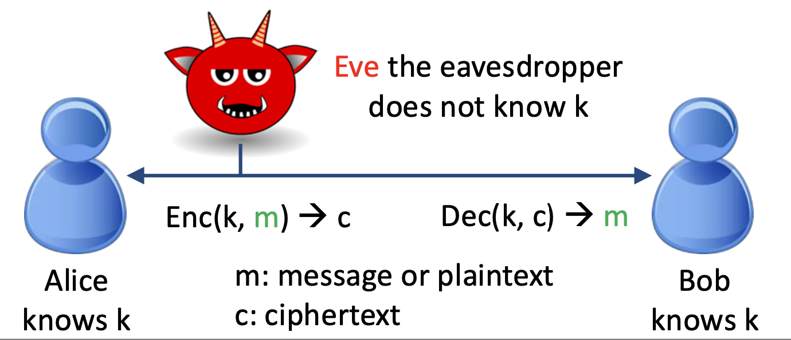

# Symmetric Encryption

Following setting - allows both parties to send messages in private (an eavesdropper cannot understand)  
we assume *Alice* and *Bob* **MUST** a secret key $k$ that *Eve* doesn't know

in comparison - Crpytography studies secure communication in **presence of an adversary** who has control over the **communication channel**
- Ex: over the internet

## History of Broken Encrpytion Schemes
**Ceasar Cipher** - shift the alphabets a fixed set of letters down    
- brute force all possible shifts - only 26 - and see what makes sense  

**Substitution Cipher** - replace each letter with a secret permutation of alphabet
PlainText  - ABCDEFGHIJKLMNOPQRSTUVWXYZ
CipherText - QWERTYUIOPASDFGHJKLZXCVBNM
- brute force would take $26!$ - not feasible  
- Solution: Given English Letter frequency analysis you can break it (sufficient statistical tests)

Enigma - Germany WW2 - substitution cipher where permutation table slowly changes - groups of three letters - some complex algo
, Alan Turing cracked it

#### Lessons
- need **security definition** that is clear and rigorous that we can test a (encripytion) scheme against
- Test/break your encryption scheme
- Do NOT roll your own crypto
- assume secret keys and a **public** algorithm

- assume Eve obtains some or many plaintext-ciphertext pairs of their choosing
philosophy by germans in WW2 was to hide their encryption algorithm - Nazi were instructed to destroy their own Enigma machines if captured

## Moderm Definition of Encryption
A game between Defenders(Proponents of Cipher) and Attacker  
- Eve picks any two messages $m_0$ and $m_1$ of **equal length** 
- we flip a coin and give Eve Enc(k, $m_b$)
- Eve guesses b 
- Eve has access to encript any feasible number of plaitext-cipher text pairs, both before, and after picking the messages

## (IND-CPA) Indistinguishability under Chosen Plaintext Attacks 
- what if Eve asks for Enc(k, m0) and Enc(k, m1) and compares with Enc(k, mb)? **Eve can win with > 0.5 probability**
- but we can do **randomized encryption**
- **biggest takeway** IND-CPA is acheivable
- One-Time pad
    - assume secret key is $\infty$-long random binary string called **pad** shared by Alice and Bob
    - do bitwise XOR with pad bit my bit
        - c = Enc(k, m): c[i] = pad[i] op m[i]
        - m = Dec(k, c): m[i] = pad[i] op c[i]
    - its a one time pad - never reusing it
    - "Without loss of generality" (often abbreviated as WLOG) means that a specific assumption or simplification made in a proof doesn't affect the general validity of the conclusion; if the proof holds for the simplified case, it automatically holds for all cases  
    - this is secure
    - but **impractical** - unrealistically long keys (pads)
    - practical version - shared long random pad

**block cipher** matches layman's intuition - more ppl use it - but 
    insecure so far?
    - This is because block cipher matches the layman opinion of encryption (think about you before taking this class) but this is exactly how why you should NOT use block cipher  
    - a better reason why is used:   
    **more use -> better studied -> most likely to be secure -> more use**
**stream cipher** - 

### history of Block Ciphers
- DES (Data Encryption Standard)
    - standardized by FIPS in 1976
    - key size $\lambda$ = 56, block size $n$ = 54
- AES ( advanced encryption Standard)
    - standardized by NIST in 2001
    - block size n = 128, key size $\lambda$ = 128,192, or 256
        - corresponds to AES-128, AES-192, AES-256
        (198, 256) are for super paranoid people
        biggest motivation
            - startups brag on internet saying 256 - convince clueless person that they have the best security against competitors  
            - cost of 256 is like 2x expensive.  
            - so most of us should use aes-128  
    - ****slightly weakened** - there is a slightly better attack than brute force
    **weakened** - attacks better than brute force, and given enough resources, attack is successful
    - understand that $2^{128}$ is an astronomical number
    - $10^{78} to 10^{82}$ atoms in the universe. $10^{78} = 2^{259.11039}$
    - $2^{56}$ ws thought to be good enough back then, 1 operation per second, but not its 
    - AES is not replaced by NIST like Hash, by NIST, possibly because a lbock cipher is harder to design (needs to be invertible with the key)

### block Cipher Modes: ECB
ECB is electronic codebook - 

## Summary
- ECB: as a substitution cipher - avoid!
- CTR: as astream cipher and one-time pad
- CBC: add more dependency among blocks
- other less common modes - CFB OFB
some modes also provide integrity - eg GCM

