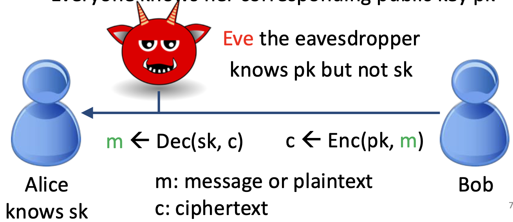
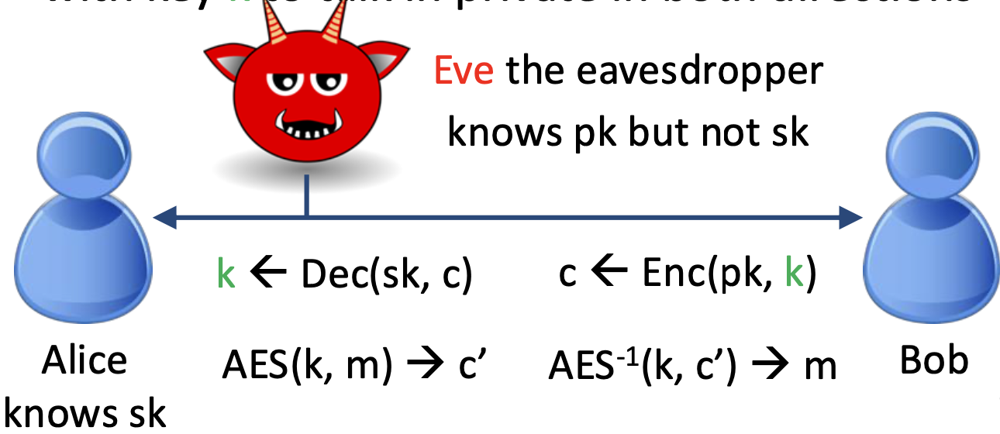
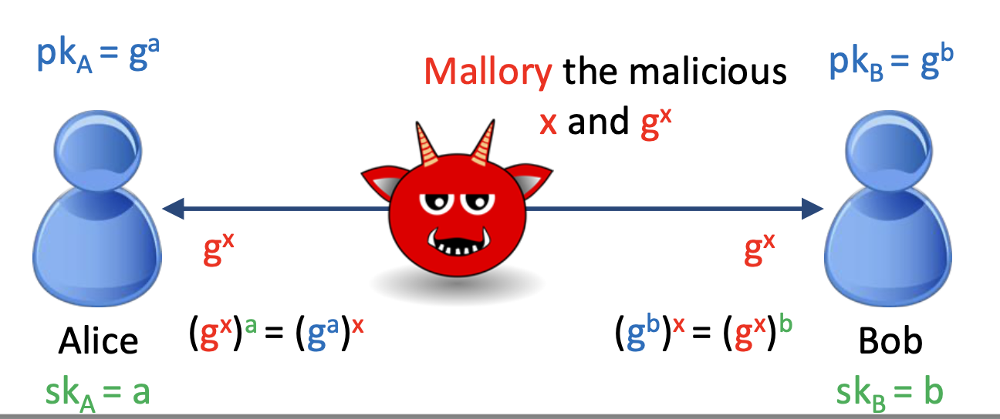

# Assymetric Encryption 
> April 3rd, 2025
#### Recap
Symm Encryption - allows 2 parties to exchange messages in private where alice and bob must share a secret key
- security definition: allow Eve to get many plaintext-ciphertext pairs (e.g., IND-CPA - Indistinguishability under Chosen Plaintext Attacks)
• Must use randomized encryption

standard for encryption - AES 128 bits atleast, any mode(CTR counter mode, CBC cipher block chaining, etc) but AVOID ECB(electronic codebook)

#### Goals
- know the interfaces and security definitions of asymmetric encryption and key exchange
– Demonstrate RSA encryption and Diffie-Hellman key exchange on toy examples
– Understand how they establish symmetric keys
– Understand man-in-the-middle attacks

### Assymetric Encryption
Allows **anyone** to send messages to Alice in private (Eve cannot read)  
Alice holds 2 keys - (1) private(secret) key $sk$ (2) public key $pk$  
Remember which key is for encryption and which key is for decryption
> only makes sense for private key to decrypt, and public key to encrypt
- Everyone knows Alice's public key pk

### Hybrid Encryption
Bob sends **symmetric key** $k$ to Alice under asymmetric encryption (Eve cannot read k)
Alice and bob then use symmetric encryption with key k for private convo in both directions

### Encrpytion Interface
- KeyGen() → (pk, sk)
    - Publish public key pk and keep private key sk private
    - sk needs to have enough entropy
- Enc(pk, m) → c
    – Everyone can encrypt
-  Dec(sk, c) → m
    – Only the key owner can decrypt

Security: IND-CPA
– We invoke $KeyGen() → (pk, sk)$
– *Eve can ask for encryptions of any messages*
– Eve picks two messages $m0$ and $m1$ of equal length
– We flip a coin $b \leftarrow \{0, 1\}$ and give Eve $Enc(pk, mb)$
– *Eve can ask for encryptions of any messages*
– Eve guesses b. Insecure iff Eve wins with 0.5 + ε probability
> Do not roll your own Crypto

### RSA cryptosystem 1978
Rivest, Shamir, Adleman cryptosystem
- **Multiplying large prime numbers** is easy, but
- **Factoring large numbers back into primes** is computationally difficult.
1983 - RSA patented by MIT, later made available for publi use after 20 yrs.
RSA brought secure communication to SSL/TLS in early 2000s.

#### Plain RSA
1. Key Generation: choose two large prime numbers $p$, $q$, calculate a modulus $n = p * q$ which forms part of the public key. An integer e (public exponent) is chosen such that it is relatively prime to (p-1)(q-1), and then a corresponding private exponent d is computed. The public key consists of (n, e), while the private key consists of (n, d).
2.	Encryption: A message is represented as a number m (where m < n) and is encrypted by computing $c = m^e \mod n$, where c is the ciphertext.
3.	Decryption: The recipient uses their private key d to decrypt the message by computing $m = c^d \mod n$, recovering the original message.

- is not IND-CPA - since plain RSA is deterministic. and if you want to kae TSA randomized and IND-CPA, they are complicated
- p and q must be kept private besides d
- p, q must be random, e need not be random, $e = 2^16 + 1 = 65537$

$a ≡ b mod(m)$ means a and b have the same remainder when divided by m. equivalent to $a mod(m) = b mod(m)$

## Key exchange
basic numger group theory
Pick a large prime p. {1, 2, 3, …, p-1} form a
group G under modular multiplication
– Multiplication x•y is defined as x•y mod p
– (Closure) If x, y are in G, so is x•y
– (Associativity): (x•y)•z = x•(y•z)
– (Identity): there exists e s.t. e•x = x•e = x
• e=1 here
– (Inverse): For each x, there exists x-1 s.t. x•x-1 = e
Can define exponentiation (again, modulo p)
– ga = g•g•g•…•g (repeated a times, modulo p)
– Note that (ga)b = (gb)a
• There are many other groups, e.g., elliptic curve

discrete-log assumption: given g and $g^a$ for a random a, infeasible to find a.  
however it is possible inteh continuous cas.e why? because no on has ever done it before!

**diffie-hellman assumption** 1976 - given g, and $g^a$ and $g^b$, it is infeasible to find $g^{ab}$
- stronger assumption that discrete-log

## Man-in-the-middle (MitM) attacks
- assymetric enc and key exchange tive two ways to establish a symmetric key   
- hwoever both are susceptible to MitM   
if  Mallory throws out Alice message, replace with x and $g^x$, 
so Alice will try to compute $g^x$ by doing $(g^x)^a$ 

what is Elliptic curve group

> apr 8th 2025 Next week
recap  
## establishing shared key
Diffie-Hellman computes a random number a and b - compute g raised to random number as a public key  
Alice computes $(g^b)^a$ and Bob computes the same  
adversary cna find $g^a$ and $g^b$
advantages to RSA encryption - ellyptical keys- faster - no issues as to private and public keys

Since alice doens't know anything about Bob, the Man in the middle can very well just become that other party. Both assymetric encryptiogn and key exchange are susceptible ot MitM Attacks  
Solution - At least one party's public key needs to be **certified** 

Applications of encryption 
- Confidential communication over the internet Ex: HTTPs, AES, end-to-end encryption
    https - http + cryptography - does key exchange, message encryption
    Signal, whatsapp 

A Man-in-the-Middle (MITM) attack is when an attacker secretly intercepts and possibly alters communication between two parties who believe they are directly talking to each other.

