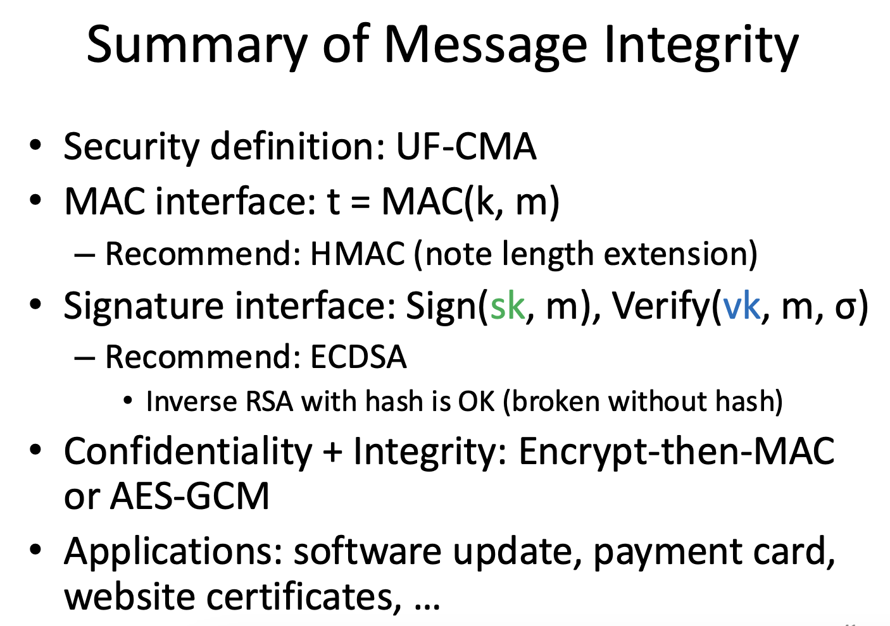

# Message Integrity
> Apr 8th 2025

By the end of this lecture you should know the following about MAC and digital signatures:
- Interface
- Security definition
- Common/recommended constructions
- Applications
- Relation to hashing and encryption
- How to achieve confidentiality + integrity

Cryptography (or Cryptology)
- Studies techniques for secure communication in the presence an adversary who has control over the communication channel

Message Integrity
- By integrity, we meant **tamper-evident**
- Symmetric vs. asymmetric 
MAC - Message Authentication Code (MAC) - Shared secret k -> MAC (symmetric)
Digital Signature 

Interface 

- MAC[k, m] -> t (called a tag)  
- Sender sends tuple (m, t)  
- receiver checks MAC(k,m0 == t?

message integrity will handle man in the middle attack

Digital Signatures
– KeyGen() → (vk, sk)
• A private signing key and a public verification key
– Sign(sk, m) → σ (called a signature)
– Verify(vk, m, σ) → True/False
- private key is for signing
- public key is for verification

UF-CMA vs. IND-CPA  
Similarities  
– Both give adversary access to many pairs of plaintext-ciphertext or message-MAC  
– Adversary can choose which message she wants to distinguish or forge  
- Key difference: adversary is not allowed to forge a message-MAC pair she has seen
– “Replay” attack is possible for MAC/signature

Unforgeability under Chosen Message Attack (UF-CMA)
• Interface: MAC(k, m) → t (called a tag)
• How do we define security of MAC?
– We pick a random key k
– Mallory can ask for MACs of any messages
– The attacker Mallory wins if she can produce a
forgery, i.e., (m, t) such that t = MAC(k, m)
• m must be a message Mallory did not ask MAC for

Sha-3 is pseudorandom - but sha2 is not
Merkle Damgard construction - absorbs chunks by chunks message - hash functions via this are not pseudorandom  
HMAC - hash-based MAC  
length extension attack may occur

## Digital Signatures
- asymmetric message authentication  
Interface  
– KeyGen() → (vk, sk)  
    - A private signing key and a public verification key  
– Sign(sk, m) → σ (called a signature)  
– Verify(vk, m, σ) → True/False  

HMAC(K, M) = H((K ⊕ opad) || H((K ⊕ ipad) || M))

K = secret key
•	M = message
•	H = hash function (like SHA-256)
•	ipad and opad = constants (inner/outer padding)

hash(secret || message)  
…which are vulnerable to length extension attacks, HMAC uses two rounds of hashing and masks the key with padding. This breaks the chaining structure that those attacks rely on.
``

## website certificates
A trusted entity called Certificate Authority (CA) signs (vouches for) a website public key.  
If signature is invalid, browser shows  
Certificate:  
    contains - issuing CA  
    Identity of the subject   
    Public key of the subject  
    RSA signature by the CA (not encryption)  
        

## Applications
### Software Updates
- critical for software to donwload the correct update package - its an integrity problem

> Hey Zoom is updated, please download this package. Zoom local cannot just download any update on the internet  

**MAC or Digital signature?**
vendor is pusshing software updaters toclient - no need for other way of communication - assymetric communication is fine 
- MAC (message authentication code) - symmetric - shared secret k  
- Digital signature - asymetric - only sender has secret sk  
    - key note - you already have verified software, you already have the Vendor's public key - you can still embed MAC
    - **However** An attacker can obtain this key just by downloading the app. **Solution:** vendor needs to use different shared symmetric key with every user (lott of overhead)
- thus, in this scenario, digital signature is ideal choice

### Payment Card
- Old cards have a magnetic swipe, which is a storage machanism

we're gonna user RSA encrpytion to make a signature - makes zero sense
it is quite embarrassing that RSA is used
Try your best to distinct - signature and encryption

explain RSA 

# 📘 Diffie-Hellman Key Exchange

## 🔹 Purpose
Securely establish a **shared secret key** between two parties over an insecure channel.

## 🔹 Key Concepts
- Based on **modular exponentiation** and **discrete logarithm hardness**.
- Used for **key exchange**, not encryption/authentication.

## 🔹 Protocol Steps
1. Publicly agree on:
   - Prime `p`
   - Generator `g`

2. Private keys:
   - Alice picks `a`, computes `A = g^a mod p`
   - Bob picks `b`, computes `B = g^b mod p`

3. Exchange `A` and `B`.

4. Compute shared secret:
   - Alice: `s = B^a mod p`
   - Bob: `s = A^b mod p`
   - Result: `s = g^(ab) mod p`

## 🔹 Security
- Eavesdropper knows `g`, `p`, `A`, `B`, but cannot compute `s` without solving **discrete log**.

## 🔹 Limitations
- No authentication → vulnerable to **MITM** attacks unless combined with:
  - Digital signatures
  - Certificates (TLS)
  - Pre-shared keys

  # 🚨 Man-in-the-Middle (MITM) Attack

## 🔹 Definition
An attacker secretly intercepts and possibly alters communications between two parties who believe they’re talking directly.

## 🔹 Attack Flow
1. Attacker positions between Alice and Bob.
2. Intercepts messages from Alice, sends forged messages to Bob (and vice versa).
3. Can read/modify messages in real-time.

## 🔹 Common Techniques
- ARP spoofing (local networks)
- DNS spoofing
- Fake Wi-Fi hotspots
- SSL stripping (downgrade HTTPS → HTTP)

## 🔹 Risks
- Credential theft
- Session hijacking
- Data tampering

## 🔹 Prevention
- **Encryption** (TLS/HTTPS)
- **Certificate validation**
- **Public key pinning**
- **VPNs**
- **HSTS** (HTTP Strict Transport Security)