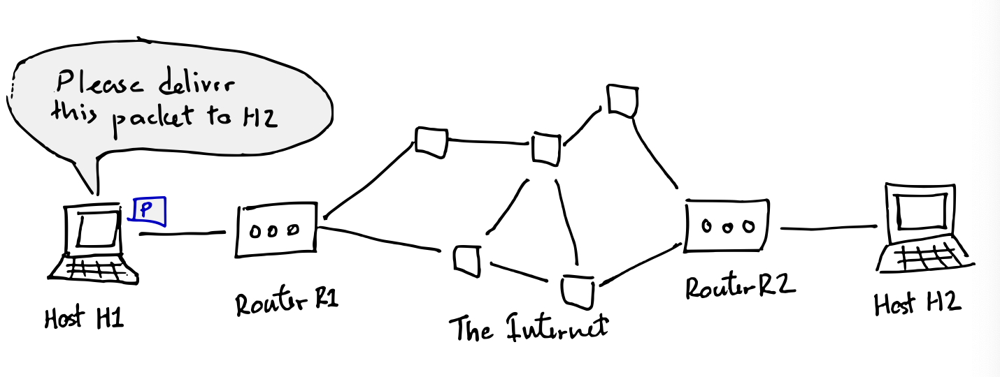
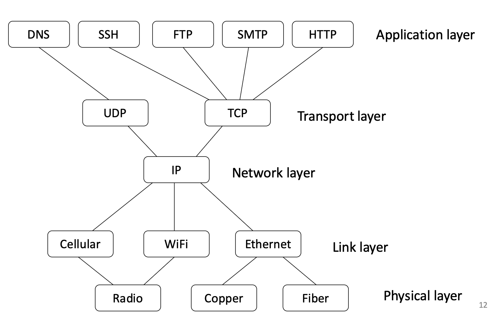
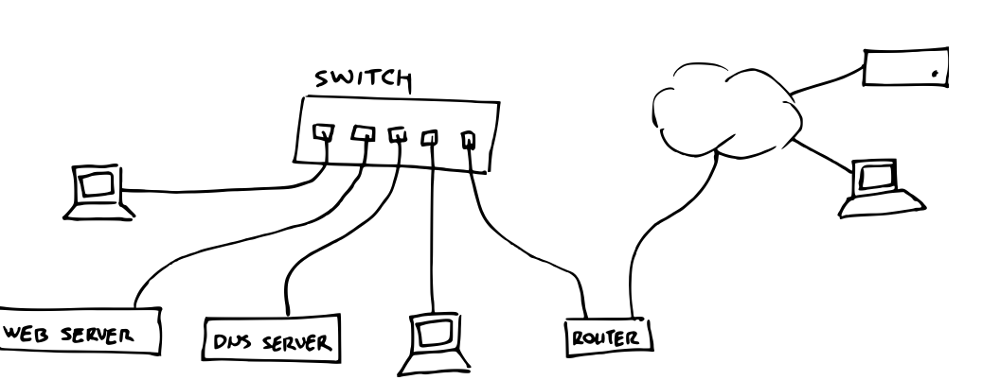
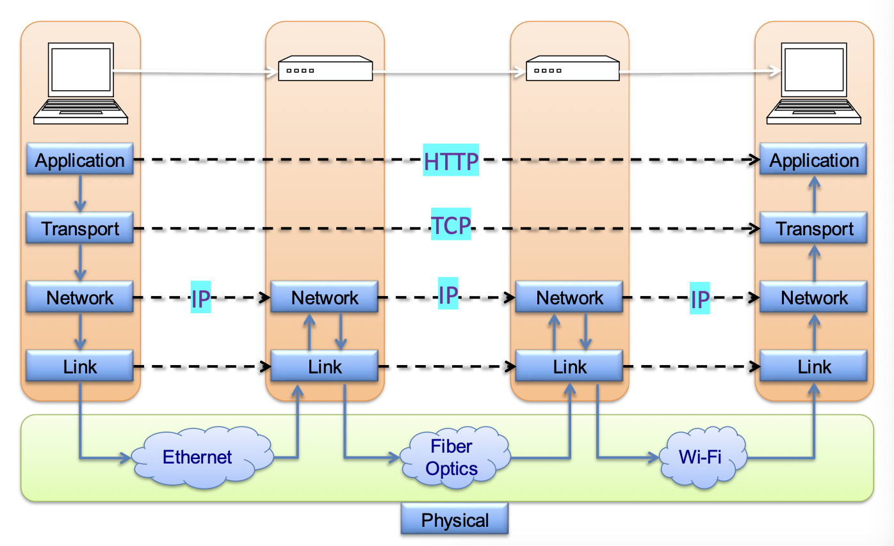
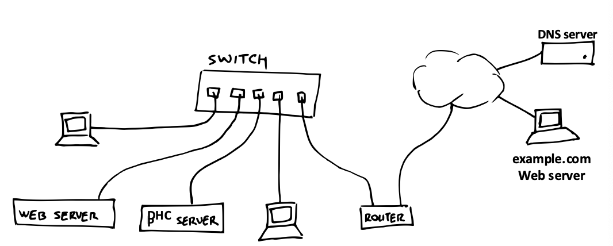

# Intro to Network
> April 10, 2025  
> Be familiar with the general workflow of network  
> Identify the different layers of the network stack  
> Know the purpose and function of each layer  
> Understand the security model of network  

Internet - is a global system that lets hosts communicate
###### to the layperson - its userful services like web, email, video, voice

### Packet Switching 
**Packet** a structured seuqnece of bytes  
    - Header: metadata sued by network  
    - Payload: data to be transported  
**routers** recieve outgoing packets from local hosts and *attempt* to deliver them to a destination

### Protocol Layering
A network isn’t defined by one protocol, but a stack of protocols!  
– Lower layers provide services to layers above  
– Higher layers use services of layers below  
– A layer (largely) doesn’t care how lower layers are implemented or what higher layers do  

The Internet Protocol Stack
- Physical Layer: Transmits raw bits over a physical data link  
- Link Layer: Transmits packets between two hosts in the same network (i.e., physically connected)  
- Network Layer: Transmits packets between two hosts in different networks (i.e., internetworking)  
- Transport Layer: Transmits packets between two processes on two hosts  
- Application Layer: Transmits packets between end-user software  

## What is a Network?
- Originally, network means a collection of *directly connected* devices - uses **physical layer*
- to talk to neighbours house - need **gateway router** and **internetworking** via **link layer** and **network layer**  
- Internetworking is connecting multiple networks
- Over the years, one such internetwork got
really big, now called the Internet
- Network layer uses the Internet Protocol (IP) (Network Layer)
- now this uses **transport layer** and **application layer**

> its all an illusion or magic that a host cna communicate to another host!

### Comparing Layers
• Network layer (IP)
    – IP addresses
    • 192.138.1.52
– Out-of-order delivery
– Unreliable (best-effort)
• Link layer
– MAC addresses
• 2C:54:91:88:C9:E3
– Out-of-order delivery
– Unreliable (best-effort)
• Transport layer
– (IP address, port)
– TCP ensures in-order and reliable delivery, and adds
flow control, congestion control, …
• UDP does not do any of these

UDP is stripped down 
UDP TCP and IP are the bakcbone of the internet  
Cellular wifi radio ethernet are all advnaces that people made  
only noteworthy things is UDP vs TCP - TCP is better, more security more features? look into 

### Internet Packet encapsulation
Technically, only the network layer use “packets”
– Transport Layer Data Unit: **Segments**  
– Network Layer Data Unit: **Packets**
– Link Layer Data Unit: **Frames**
– Physical Layer Data Unit: **just bits**

Encapsulation is the process of wrapping data (from a higher layer) into a packet of a lower layer so it can be transmitted over a network.

### 🌐 TCP vs UDP

#### 🔹 Overview

| Feature           | **TCP** (Transmission Control Protocol) | **UDP** (User Datagram Protocol) |
|------------------|------------------------------------------|----------------------------------|
| Connection        | Connection-oriented                     | Connectionless                   |
| Reliability       | ✅ Reliable (retransmits lost packets)   | ❌ Unreliable (no retransmissions) |
| Ordering          | ✅ Guarantees packet order               | ❌ No ordering guarantee          |
| Speed             | ❌ Slower (more overhead)                | ✅ Faster (less overhead)         |
| Error Checking    | ✅ Yes (with ACKs, checksums)            | ✅ Basic (checksum only)          |
| Congestion Control| ✅ Yes                                   | ❌ No                             |
| Use Cases         | Web (HTTP/HTTPS), Email (SMTP), FTP     | Gaming, VoIP, DNS, Streaming     |

---

#### 🔹 TCP – Key Characteristics

- Ensures **reliable, in-order delivery** of data
- Uses **3-way handshake** to establish connection
- Provides **flow and congestion control**
- Suitable for **applications that can’t afford data loss**

---

#### 🔹 UDP – Key Characteristics

- Sends data as **datagrams** with **no guarantee**
- **No handshake**, minimal overhead
- Suitable for **real-time apps** where speed matters more than reliability

---

#### 🔹 Summary

- **Use TCP** when you need **accuracy and reliability**
- **Use UDP** when you need **speed and can tolerate loss**

### Implications of the Internet’s Hourglass Shape?
- Easy to roll out new application protocols
(new process)
- Possible, but harder, to roll out new transport
protocols
- Easy to deploy new network architectures
(e.g., 5G) and new physical media (e.g., fiber)
- A universally agreed upon protocol (IP) for
connecting networks together

## How does your laptop access the Internet?

### Step 0: Join a local network
- Establish a physical connection  
- Get from a DHCP server: (A DHCP server (Dynamic Host Configuration Protocol server) is a network server that automatically assigns IP addresses and other network configuration parameters to devices on a network, making it easier to manage and connect devices.)  
    – IP address for your laptop and **lease** duration  
    – IP address of gateway router  
    – IP address of DNS server  
> TCP is th magicall illusion that allows two devices two connect without worrying about any network connection 

### Step 1: DNS Lookup  
- You type a URL example.com into the browser  
- Browser queries DNS (Domain Name System) server for the IP address of example.com  
- DNS is an application-layer protocol  
– Which uses UDP at transport-layer, which uses IP at network-layer, which uses link-layer …  
– Laptop → gateway router → router → … → router  
→ DNS server  

### Step 2: TCP Connection
-  Set up a TCP connection with example.com  
- TCP is a transport-layer protocol  
    – IP at network-layer, link-layer, …  
    – Laptop → gateway router → router → … → router  
    → example.com web server  

### Step 3: Start Communicating
- HTTP request and response
    – Using the TCP connection, IP, link-layer, …  
    – Laptop → gateway router → router → … → router → example.com web server  

###### btw lots of concerns of message integirty every step of these events  

## (LAY) Security Properties
CIA Triad + auth  
    - Availability:  
        no one can deny me access to services  
    - Confidentiality:  
        no one can “see” my private information  
    -  Integrity:  
         no one can “mess with” my data  
    - Authenticity:  
        no can pretend to be someone else  

## Network Seucirty Thread Model  
- Different attacker models:
    - Passive vs active attackers
        - passive is just monitoring, 
    - off-path vs on-oath atttackers
        - talks about whther the normal communication of events went through the attack or not

**passive on-path attacker** - can see all packets but cannot (or will not) modify them  
    - ex: ISP just wants to monitor you
**Active off-path attacker** - can inject packets into the network but cannot see traffic between the hosts  
    - ex: hacker somewhere on the internet

**active on-path (MitM) attacker** - (most powerful attacker) - can see, modify, inject and drop all packets  
    - ex: free wifi - coudl be some attacker who set it up

