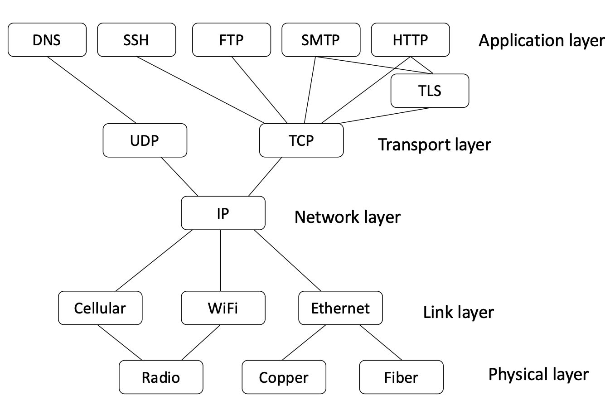

# Transport Layer Security

TLS is kinda layer 4.5
TLS is a secure wrapper of TCP


```Precursor to TLS - is SSL - secure sockets Layer developed by ```netscape for secure web sessions 1995. Transport Layer Seucirty evo
lved from SSL and replaced it (1999).  

- Use key exchange or asymmetric encryption to establish a shared secret key
- Use the shared secret key for symmetric encryption and message authentication

new 
