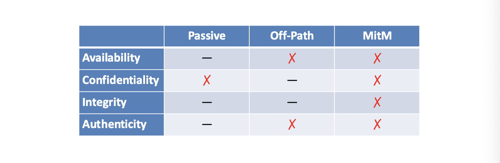
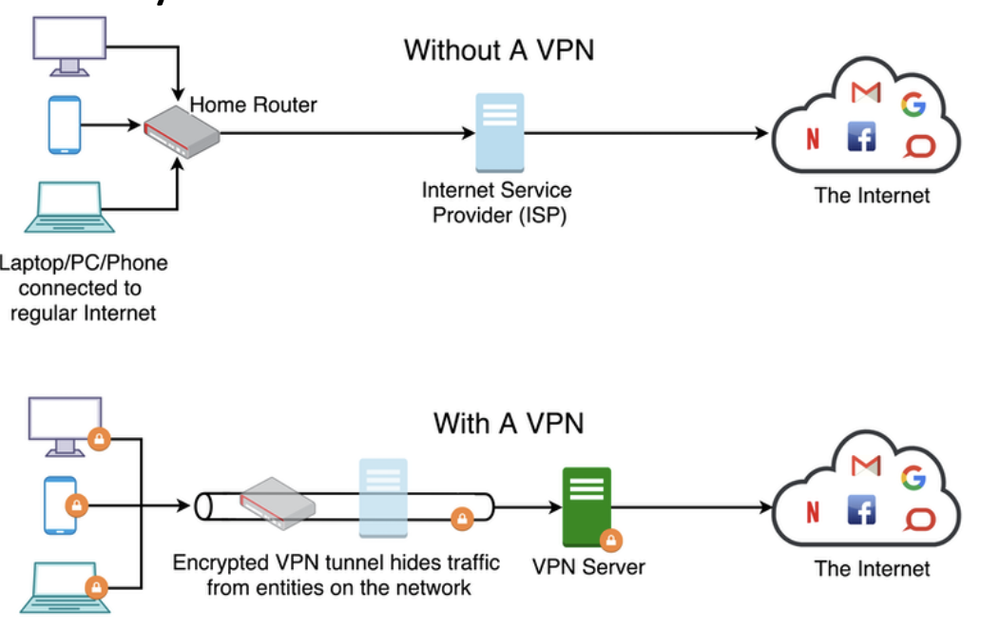
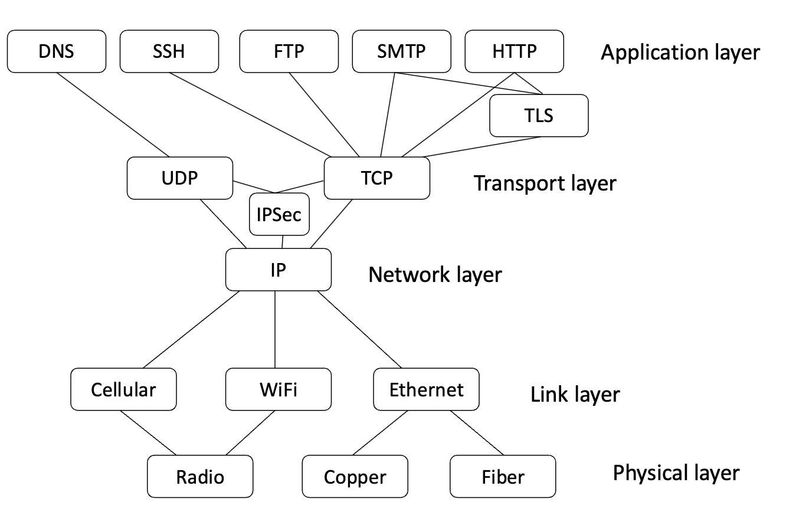
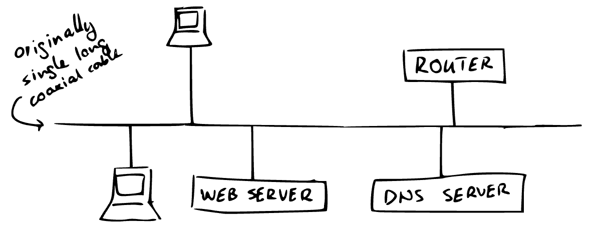
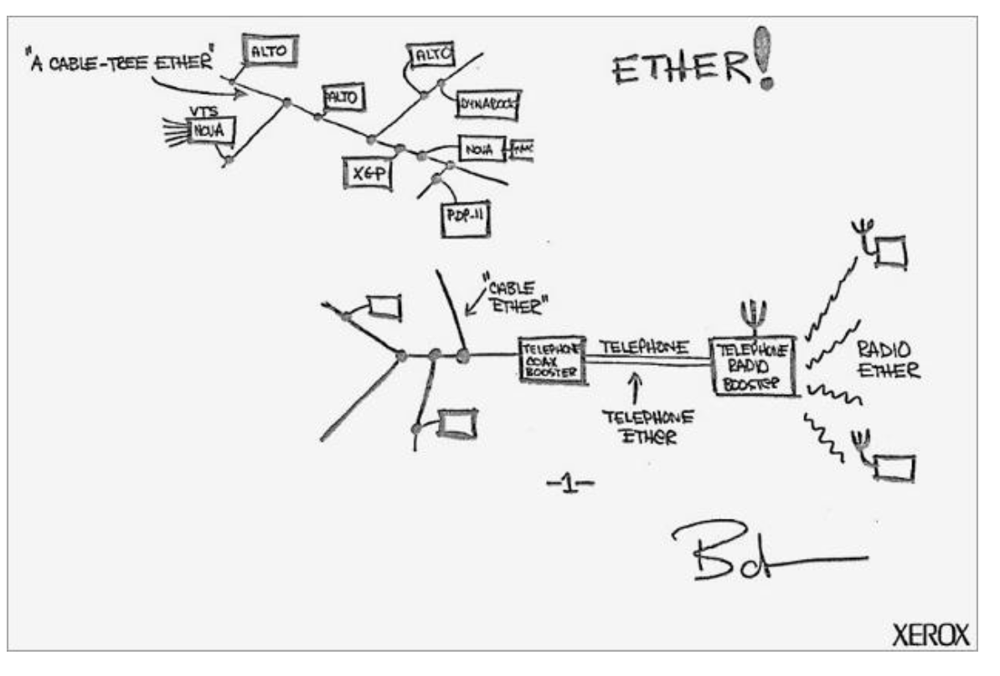
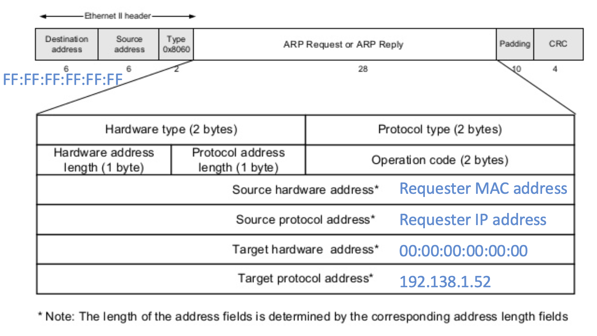
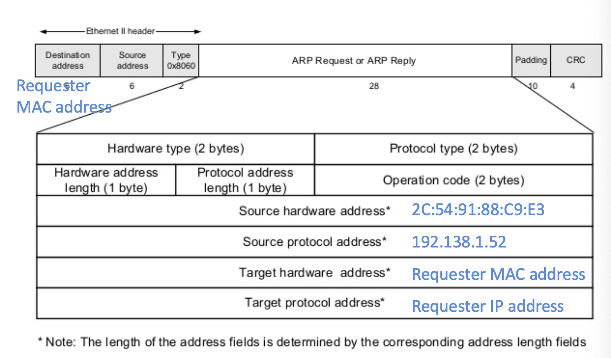
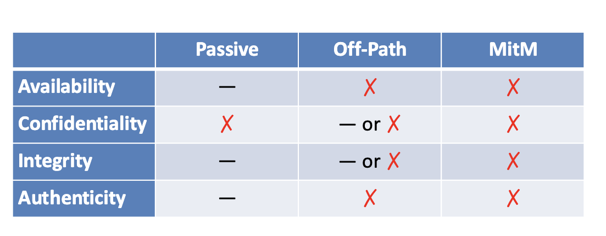

# Link and Network Layer Security

By the end of this lecture, you should be able to:

- Understand the security and insecurity aspects of the IP, IPSec, and BGP protocols.
- Comprehend the role of Ethernet and how it integrates the link and network layers.
- Analyze the security vulnerabilities and mechanisms of the Address Resolution Protocol (ARP).

## IP

The Internet Protocol (IP) is a fundamental protocol in the Internet stack that defines the structure of packets (**datagrams**) and how they are routed across networks. It operates at the network layer and provides addressing and routing mechanisms to ensure data reaches its intended destination.

### Types of IP Addresses:
- **IPv4**: Uses 32-bit host addresses.
    - Written as `A.B.C.D`, where each segment is an 8-bit integer in decimal (dotted quad format), e.g., `192.168.1.1`.
    - 4.3 billion unique addresses
- **IPv6**: Uses 128-bit host addresses.
    - Written as `A:B::X:Y:Z`, where each segment is a 16-bit integer in hexadecimal. The `::` notation represents consecutive zero bytes, e.g., `2620:0::e00:b:53` is equivalent to `2620:0:0:0:0:e00:b:53`.
    - 340 undecillion addresses

IP header - tells routers what to do with the packet
Rest of packet(payload) is opaque to router

Recall that, by definition,  
– For a passive attacker, confidentiality is the only concern
– An off-path attack cannot break confidentiality or integrity

## Security Properties of IP

**TCP provides authenticity against off-path attacks** because it is stateful. Each time a packet is sent, the sequence number is incremented by 1. 

In contrast, **IP does not provide authenticity against off-path attacks** because it is a stateless protocol. Unlike TCP, which maintains a connection state and uses sequence numbers to track and validate packets, **IP simply forwards packets based on their destination address without maintaining any session information**. This lack of state makes it vulnerable to spoofing and other off-path attacks, as there is no inherent mechanism to verify the authenticity of the sender.
### Attacker Types and Capabilities

Think of attackers as players in a game:

- **Passive**: A spectator with binoculars, observing traffic without interfering.
    - **Capabilities**: Eavesdropping only.
    - **Example**: Packet sniffer on open Wi-Fi.
- **Off-Path**: A person shouting from the stands, sending spoofed packets but unable to see traffic.
    - **Capabilities**: Can send spoofed packets but cannot observe traffic.
    - **Example**: IP spoofing attack from another machine.
- **On-Path (MitM)**: A referee rigging the match, intercepting, modifying, and injecting traffic.
    - **Capabilities**: Full visibility and control over traffic.
    - **Example**: ARP spoofing, rogue Wi-Fi access point, or compromised router.
- **Insider**: A teammate leaking the playbook, exploiting privileged access.
    - **Capabilities**: Access to internal systems or sensitive information.
    - **Example**: Malicious employee or compromised insider credentials.

## IPSec
IPSec adds cryptographic security on top of IP, similar to how TLS adds security on top of TCP. It is designed to provide secure communication over potentially insecure networks by ensuring data integrity, confidentiality, and authenticity.

### Two Main Protocols in IPSec:
- **Authenticated Header (AH)**: Provides integrity and authenticity but does not offer confidentiality. It ensures that the data has not been tampered with during transit.
- **Encapsulation Security Payload (ESP)**: Provides both confidentiality and integrity. It encrypts the payload and ensures that the data is secure and unaltered.

### Is IPSec Used in Practice?

**Yes, IPSec is widely used in practice, especially in Virtual Private Networks (VPNs).** It enables secure communication between remote users and corporate networks or between different networks over the Internet. However, its adoption in end-to-end communication (e.g., between individual devices) is less common compared to application-layer security protocols like TLS.

### IPSec vs. TLS: Pros and Cons

| **Aspect**                | **IPSec**                                                                 | **TLS**                                                                 |
|---------------------------|---------------------------------------------------------------------------|-------------------------------------------------------------------------|
| **Layer**                 | Operates at the network layer, protecting all network traffic.            | Operates at the application layer, protecting only specific application traffic (e.g., HTTP). |
| **Scope**                 | Secures all traffic between endpoints, regardless of the application.     | Secures only the application using it (e.g., HTTPS for web traffic).   |
| **Ease of Use**           | Typically requires installing additional software or configuring devices. | Can often be used directly via a browser or application without extra setup. |
| **Use Case**              | Commonly used for site-to-site or remote-access VPNs.                    | Commonly used for securing web traffic and other application-specific communications. |

### Key Takeaways:
- IPSec is ideal for securing all traffic between networks or devices, making it a robust choice for VPNs.
- TLS is more lightweight and user-friendly for securing specific application-layer communications, such as web browsing.

## Routing
### Routing

Internet routing is managed through **Autonomous Systems (AS)**, large networks controlled by single entities (e.g., AT&T, Verizon). Routing is divided into:

- **Intra-AS Routing**: Internal routing within an AS using protocols like OSPF (e.g., finding shortest paths) or EIGRP.
- **Inter-AS Routing**: External routing between ASs using  **Border Gateway Protocol (BGP)**. BGP:
    - Shares reachability info (e.g., AS A tells AS B it can reach network X).
    - Selects optimal routes based on policies and attributes (e.g., shortest path or preferred provider).

**BGP Vulnerabilities**: Susceptible to attacks like:
- **Route Hijacking**: Malicious AS claims ownership of another AS's IP range (e.g., redirecting traffic).
- **Prefix Leaks**: Misconfigured AS advertises incorrect routes, causing disruptions.

BGP is essential for global Internet connectivity but requires robust security measures.

## Link Layer

The link layer is responsible for transmitting packets between directly connected hosts. It provides the physical and logical connectivity required for communication between hosts and routers.

### Local Area Networks (LANs)
- LANs connect hosts that can communicate directly without needing an intermediary router.
- A router on a LAN acts as a gateway, forwarding IP datagrams to the broader Internet.

### Ethernet
- **Definition**: The most widely used wired LAN protocol, encompassing both the physical (Layer 1) and link (Layer 2) layers.
- **Physical Layers**: Ethernet supports various physical mediums (e.g., copper, fiber, Wi-Fi).
- **Logical View**: Originally designed as a single shared cable where all packets were broadcast to every device on the network.

#### Historical Context
- The original Ethernet design by Bob Metcalfe (May 22, 1973) revolutionized networking by enabling shared communication over a single cable.

### IP vs. MAC Addresses
- **IP Address**: Changes based on the network you join (e.g., home, work, café).
- **MAC Address**: A unique 48-bit identifier assigned to every network device. 
    - The first 24 bits identify the manufacturer.
    - MAC addresses are globally unique but can be spoofed.

#### Fun Fact:
While rare, duplicate MAC addresses can occur due to manufacturing errors. However, this is often inconsequential since MAC addresses can be overridden or spoofed.

### Key Takeaways:
- The link layer ensures direct communication between physically connected devices.
- Ethernet remains the backbone of wired LANs, with its design evolving to support modern networking needs.
- MAC addresses provide device-level identification, but higher-layer protocols ensure secure and reliable communication.

## Address Resolution Protocol (ARP)

ARP maps IP addresses to MAC addresses within a LAN. It operates by broadcasting requests and receiving replies.

### How ARP Works:
1. **Request**: A host broadcasts an ARP packet:  
    *"Who has IP address 192.138.1.52?"*
2. **Reply**: The host with that IP responds:  
    *"IP 192.138.1.52 is at MAC address 2C:54:91:88:C9:E3."*
3. **Caching**: The requester stores this mapping for future use.

### ARP Packet Format:
- **Request**: Broadcast to all devices on the LAN.  
  
- **Response**: Sent directly to the requester.  
  

### Security Concerns:
- **No MitM Protection**: ARP lacks mechanisms to prevent on-path attacks.
- **Off-Path Attackers**: Can become on-path via ARP spoofing.  
  

### Securing ARP:
1. **Static ARP**: Manually configure IP-MAC mappings.  
    *Con*: High maintenance overhead.
2. **Smarter Switches**: Detect suspicious behavior (e.g., a MAC claiming multiple IPs).  
    *Con*: May miss targeted attacks.
3. **Smarter Hosts**: Alert on impersonation attempts.  
    *Con*: Authenticity of alerts is questionable.
4. **Cryptographic Solutions**: Use PKI for authentication.  
    *Con*: High maintenance cost.

### Practical Considerations:
- ARP is inherently insecure, but higher-layer protocols like TLS and IPSec mitigate risks.
- Wireless networks often require passwords and use encryption (e.g., WPA2, WPA3) to enhance security.

### Key Takeaways:
- ARP is foundational but lacks robust security.
- Rely on higher-layer protocols and physical security to protect against attacks.
- On unsecured networks, protocols like TLS and IPSec provide sufficient protection.
