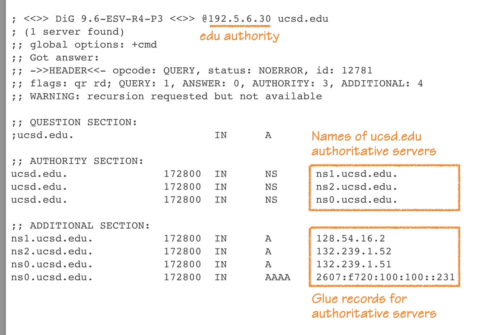
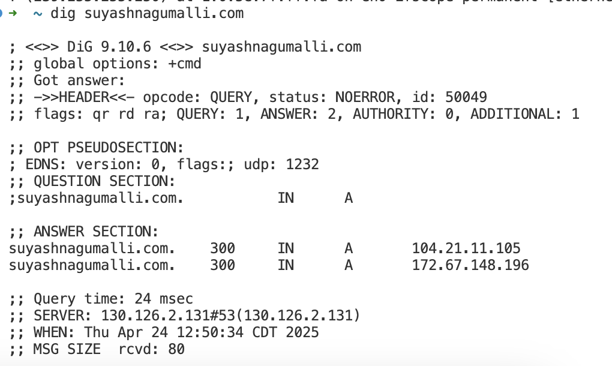
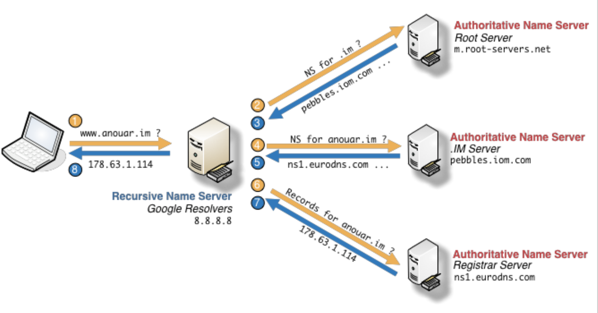

# DNS - Domain Name System
> **April 24th, 2025**

## Learning Objectives
- Understand the high-level workings of DNS.
- Learn how name servers can be polluted by spoofed DNS queries.
- Evaluate defenses for DNS cache poisoning and how they avoid a full redesign of the DNS infrastructure.

## Overview
Before DNS, the internet was like a world where you had to memorize every friend's phone number (IP address). As the internet grew, this became unmanageable. DNS was created as an “internet phonebook” at the **application layer**—the same level as protocols like SSH, FTP, SMTP, and HTTP.

## What is DNS?
The Domain Name System (DNS) serves as:
- **An administrative structure:** Keeps track of who owns which domain names.
- **A global, distributed database:** So no single computer or country controls all the domain names.
- **A protocol for lookup:** Translates human-friendly names like `google.com` to machine-friendly IP addresses.

**Analogy:**  
Think of DNS like a massive, decentralized address book that everyone on the internet can use to look up where to send their digital "mail."

## DNS Hierarchy
Hostnames are organized hierarchically, like a tree. For example:
- `ece.illinois.edu`
    - `ece`: **3rd-level domain** (the department)
    - `illinois`: **2nd-level domain** (the university)
    - `edu`: **top-level domain (TLD)** (the type of organization)

### ICANN
- **ICANN**: The global organization that manages domain names.
    - Country codes (`.us`, `.uk`), and generic TLDs (`.com`, `.net`).
    - You "rent" your domain (e.g., `yourname.com`) from a registrar.
    - Universities like UIUC control subdomains under their main domain.
    - 

## DNS Server Roles
1. **Authoritative Server**:  
   The "official source" of records for a domain (like a company’s HR office confirming your employment).
2. **Recursive Resolver**:  
   Works on behalf of the user, asking around until it finds the right answer, then caches it for faster access next time.

## DNS Name Resolution: How Does It Work?
**Example:** Resolving `www.anouar.im`  
1. Your computer asks a **recursive resolver** (like Google DNS).
2. The resolver checks:
    - The **root name server** for who manages `.im`.
    - The **.im server** for who manages `anouar.im`.
    - The **registrar's authoritative server** for the final answer (A/AAAA record).

>   
> 

## DNS and the Transport Layer
- DNS usually uses **UDP** for its queries—fast, no handshake.
- Sometimes uses **TCP** for large responses (e.g., DNSSEC, zone transfers).

## Common DNS Records
- **A record**: Maps a domain to an IPv4 address.
- **AAAA record**: Maps a domain to an IPv6 address.
- **NS record**: Tells you who is authoritative for a domain.
- **MX record**: Tells you where to send email for a domain.

## Tools and Concepts
### `dig` - Domain Information Groper
- A command-line tool to look up DNS records for a domain.

### TTL - Time to Live
- Each DNS answer has a **TTL**—how long it should be cached before asking again.

> 

## Bailiwick Rules
- **Bailiwick**: The set of domains a DNS server is allowed to answer for.
    - Keeps servers from giving out records they shouldn’t.
    - Example: The `.edu` server should not give records for `.com` domains.

## Off-Path Authenticity Attacks on DNS

### Scenario 1: Fake Reply Injection
- **Off-path attacker**: Can’t see your queries, but can guess when you’re making one.
- They inject a fake DNS reply, hoping it arrives before the real one.
- **Why it’s hard:** They must guess the correct transaction ID and timing.

### Scenario 2: Cache Poisoning
- A malicious authoritative server gives the resolver a fake answer.
- That answer gets cached—other users get directed to the wrong place too.

## Timing the Fake Reply (How Attacks Work)
**Example:** Attacker tricks you to load:
```html

```
- Your browser asks the DNS resolver for `www.paypal.com`.
- Attacker races to inject a fake response with the resolver’s expected parameters.
- If the resolver accepts it, everyone using that resolver is now in danger.

### DNS Spoofing—How Likely Is It?
- **Old DNS:** Transaction IDs were predictable (sequential), so attackers could easily guess.
- **Modern DNS:** Transaction IDs are random 16-bit numbers.
- **Chance of a correct guess:** 1 in 65,536 (2^-16).
- If attacker wins the race, their fake answer is cached until TTL expires.

### Kaminsky’s Attack (2008)
- **The innovation:** Attackers ask for many non-existent subdomains (e.g., `aaa.paypal.com`, `aab.paypal.com`, …).
- **Each query = a new chance to guess the right transaction ID.**
- **Bypassing TTL:** Because each is a fresh question, TTL doesn’t stop the attacker.
- **Why it works:** Due to the Bailiwick Rule, additional answers (e.g., for `www.paypal.com`) can be accepted if bundled in the attacker’s forged response.

### Probability of Attack Success
- With N simultaneous queries and spoofed responses, chance of success:  
  **Success chance = N × 2^-16**
- The attack is repeatable almost instantly—making it practical with enough tries.

### Defenses Against Kaminsky’s Attack
- **Increase randomness:**
  - Randomize the UDP source port (16-bit).
  - Randomize capitalization of domain (adds up to 12 bits; called 0x20 encoding).
- **Result:**  
  Now, attacker must guess:
  - Transaction ID (16 bits)
  - Source port (16 bits)
  - Capitalization pattern (12 bits)
  - **Total entropy:** 44 bits.  
  **Chance:** N × 2^-44 (much, much harder!)

### DNSSEC (DNS Security Extensions)
- **What it does:**  
  Digitally signs DNS records to prove authenticity (not just the reply).
- **Requires:**  
  Root of trust, certificate infrastructure.
- **History:**  
  Proposed in 1997, current version from 2005.
- **Adoption:**  
  Still low—many rely on TLS/HTTPS as the main protection.

## Why It Matters
- DNS cache poisoning can silently redirect users to fake sites, steal credentials, or spread malware—all while showing the correct domain name in the browser.
- Modern defenses don’t break the whole DNS system; they just add layers of unpredictability, making attacks much less likely to succeed.

## Further Reading
- Cloudflare: DNS Cache Poisoning
- Kaminsky Attack Explained (Dan Kaminsky, 2008)
- Wikipedia: DNS Spoofing
