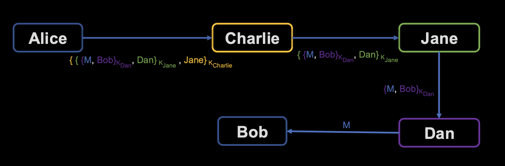
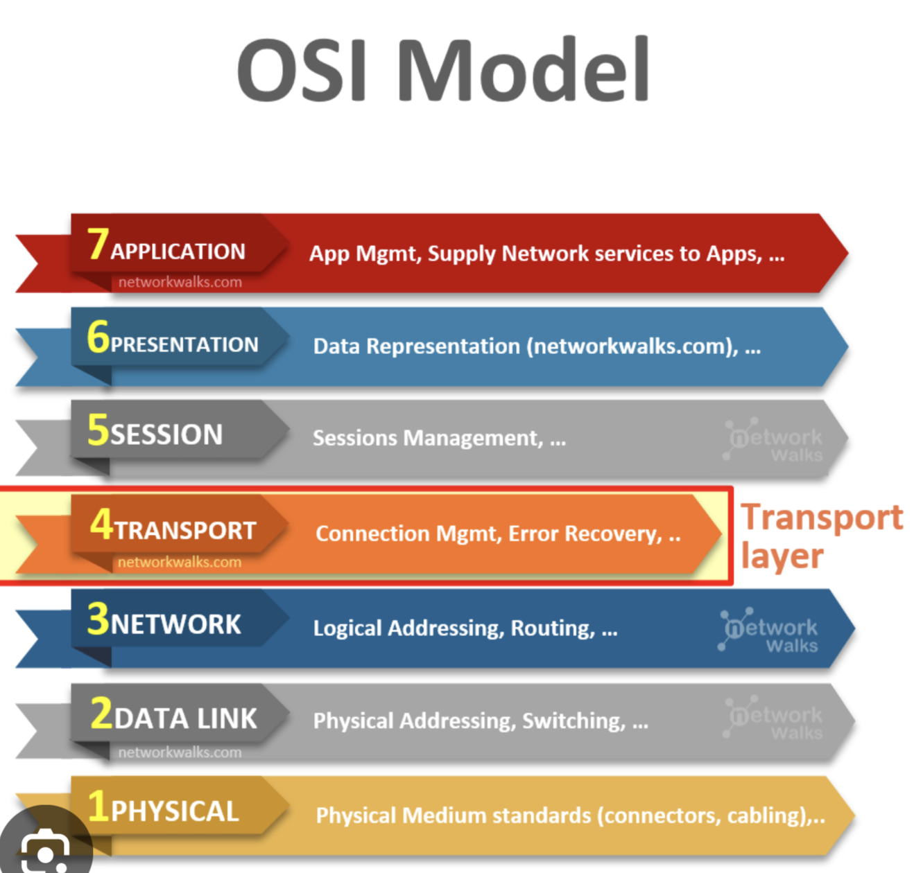
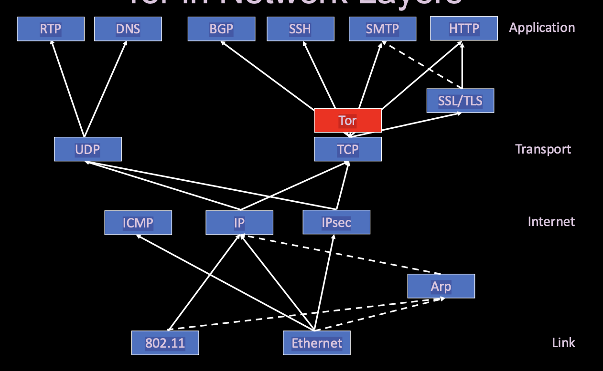
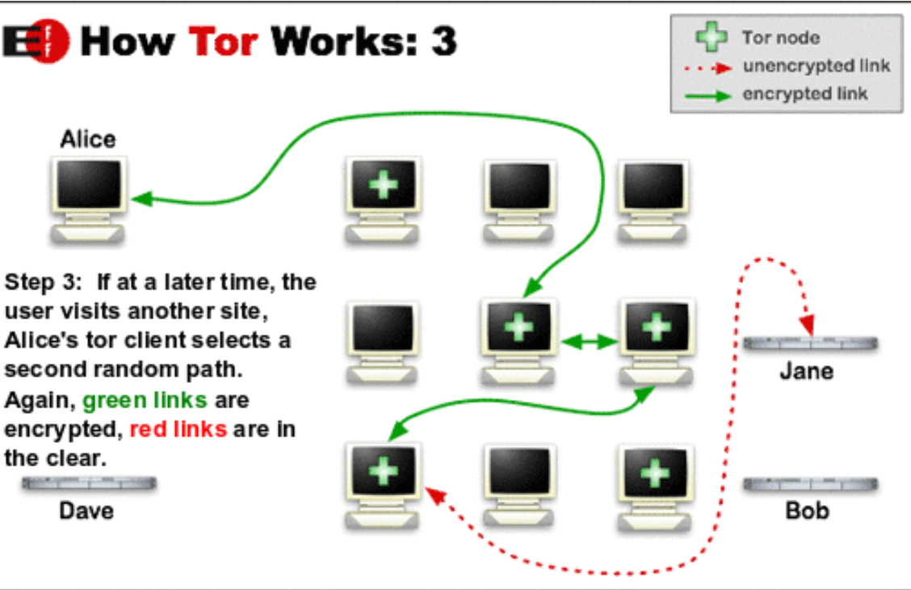
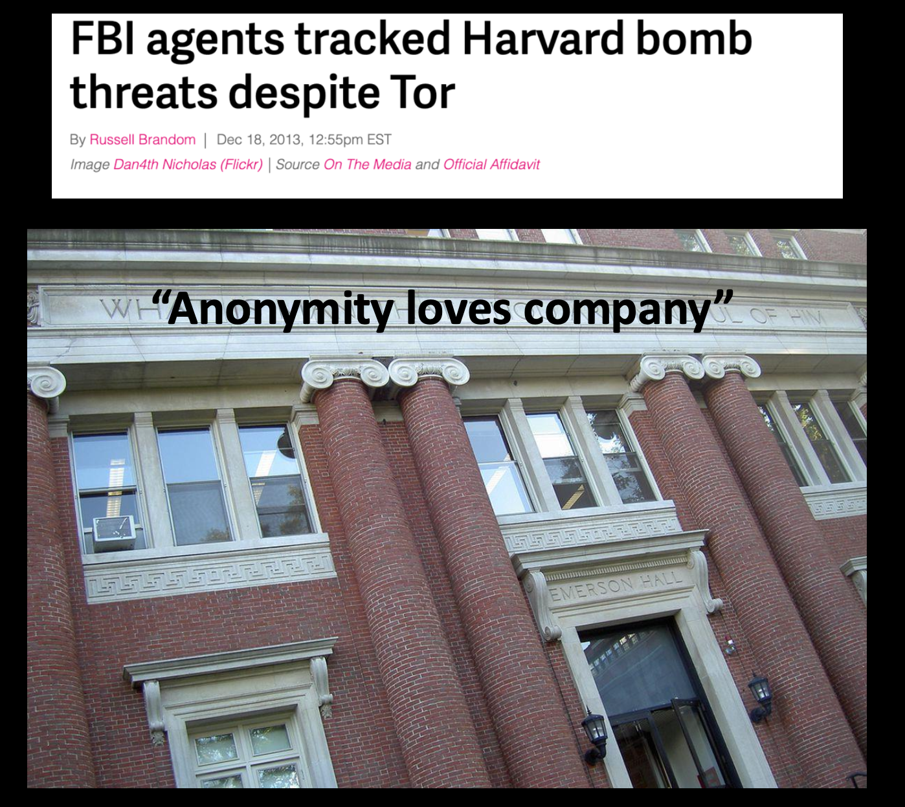
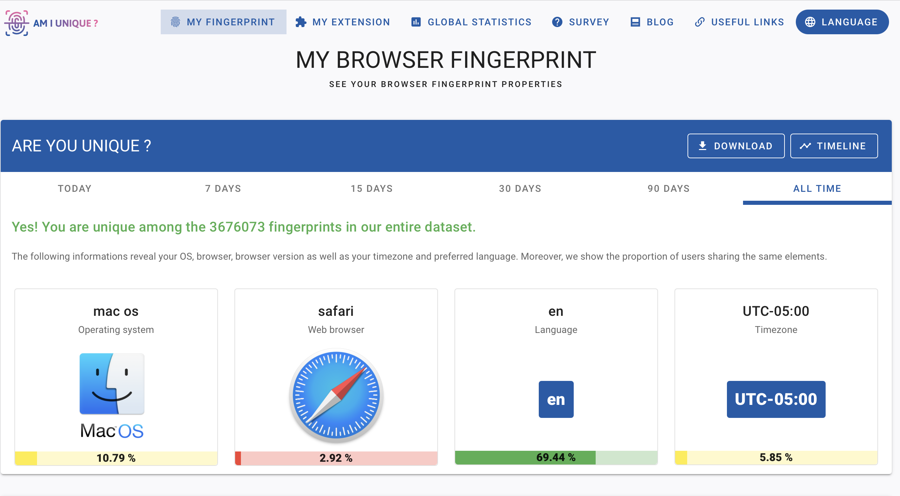

# Anonymity Notes
> Thursday May 1st, 2025 

## Course Information
**Course:** ECE 422 / CS 461  
**Institution:** University of Illinois  

## Goals
- Understand the concept of anonymity and its relationship to other security properties.
- Present arguments both for and against anonymity in online contexts.
- Learn how anonymity tools function and the methods used to attack them.
- Explore web tracking mechanisms and strategies to avoid being tracked.

## What is Anonymity?
- **Definition:** Anonymity refers to the act of concealing one’s identity.
- **Comparison with Confidentiality:**
    - **Confidentiality:** Focuses on protecting the content of communication (what was said).
    - **Anonymity:** Focuses on protecting the identities involved in the communication (who said it and to whom).
    - Confidentiality does not guarantee the absence of information leakage.
- **Potential Information Leakage:**
    - What can be leaked? Metadata.
    - To whom can it be leaked? Adversaries, third parties, or unintended recipients.

## Metadata – Data About Data
Metadata provides contextual information about communication, such as:
- **Who:** The parties involved in the communication.
- **What:** The means or medium of communication.
- **Where:** The network or geographic location of the parties.
- **When:** The timing, duration, and frequency of communication.
- **How much:** The volume of data exchanged.

> **Quote:** “We kill people based on metadata.”  
> — Michael Hayden, Former Director of NSA and CIA

## Is Online Anonymity Good or Bad?

### Arguments For Anonymity:
- **Civil Liberties:** Protects freedom from surveillance and promotes privacy.
- **Whistleblower Protection:** Enables individuals to expose wrongdoing without fear of retaliation.
- **Prevention of Profiling:** Reduces the risk of user profiling and discrimination.

### Arguments Against Anonymity:
- **Illegal Activities:** Facilitates criminal behavior and illicit activities.
- **Misinformation:** Allows the spread of false information without accountability.
- **Toxicity:** Encourages harmful behavior due to lack of accountability.

## How Can Anonymity Be Achieved?

### Virtual Private Network (VPN)
- **Definition:** A proxy (intermediary) that relays traffic between the user and the destination.
- **How It Works:**
    - Alice sends an encrypted message to the VPN, including the destination.
    - The VPN decrypts the message and forwards it to the destination.
    - The destination (Bob) does not know the message originated from Alice.
    - A passive eavesdropper (Eve) cannot determine that Alice is communicating with Bob.

### Limitations of VPNs:
- Single point of trust: The VPN provider can see both the source and destination of traffic.

### Better Approach: Tor (The Onion Router)
- **Definition:** A system that uses multiple hops of proxies to ensure no single hop knows everything.
- **Layered Encryption (Onion Routing):**
    - Alice encrypts the message in multiple layers.
    - Each relay decrypts its layer to reveal the next hop.
    - No single node knows both the source (Alice) and the destination (Bob).

#### Key Nodes in Tor:

1. **Entry (Guard) Node:**
    - Knows the user (Alice) is using Tor and the next hop (Charlie).
    - Does not know the final destination (Bob).
2. **Middle (Transit) Node:**
    - (Jane) Knows the previous and next hops but not the source or destination.
3. **Exit Node:**
    - Knows the destination (Bob) and the previous hop (Jane).
    - Does not know the source (Alice).

- Alice establishes a unique session key with each intermediary node using Diffie-Hellman key exchange, ensuring end-to-end encryption across the Tor circuit. So Alice knows charlie, jane, dan - handpicked them to be the relay nodes.

- this whole path is known as a circuit - called circuit based forwarding - so Dan knows where Jane is - Circuit 129 is here and so and so. 
- Bob’s response is encrypted in layers by each relay before being sent back to Alice.

#### Limitations of Tor:
- Tor does not encrypt traffic between the exit node and the destination. Users must encrypt sensitive data themselves.

## Tor in the Network Stack
- Tor operates at the **transport layer**, enabling TCP connections without revealing the user’s IP address. (TLDR Tor is anonymous version of TCP)
- It interacts with other protocols like HTTP, SSL/TLS, and DNS.

transport layer is layer 4
- in contrast, VPN would sit above IPsec. Tor 

## Tor Network
- Composed of approximately 6,300 volunteer-run nodes/servers worldwide.
- Directory servers (currently 9, managed by the Tor Project) maintain node listings.
- Users randomly select relay nodes for their connections (typically 3 nodes).

## How Tor works
1. Alice's Tor client obtians a list of Tor nodes from a directory server (Dave)
2. Alice's Tor client picks a random path to destination server. **Green links** are encrypted, **red links** are in the clear (unencrypted). Gradually building 
3. If at a later time, the user visits another site, Alice's Tor client selects a second random path. 

## Challenges to Tor Anonymity
> Claim: If *at least one* of the relay nodes is honest, it is hard to link Alice to Bob. 

hmm.. lets see if thats true..  
### Adversary-Controlled Nodes:
- An adversary may volunteer many nodes, hoping to control the entire path of a user’s connection.
- Compromising directory servers can undermine anonymity. 
    - the attack can then proceed by choosing a path with nodes that are your friends. 

### Side Channel Correlation:
- Observing the first and last connections allows attackers to correlate traffic using side channels like:
    - Packet length.
    - Timing patterns.

### FBI Harvard Case Study: Anonymity in Practice

#### Scenario:
- A student at Harvard (Alice) uses Tor to send an anonymous email to the Harvard email server (Bob).
- Harvard monitors its network and observes Alice's connection to the Tor entry node (Charlie).
- Simultaneously, Harvard collaborates with law enforcement to monitor the Tor exit node (Dan) connecting to Bob.
- By correlating these observations, Harvard links Alice to the anonymous email, compromising her anonymity.

#### Lessons Learned:
- **Side Channel Correlation:** Monitoring both ends of a Tor connection (entry and exit nodes) can reveal the source and destination, breaking anonymity.
- **Avoiding Detection:** 
    - Use public Wi-Fi (e.g., at a café) to avoid being directly associated with your institution's network.
    - Ensure your activity blends into a larger crowd to avoid standing out.

#### VPN vs. Tor:
- **VPN:** While a VPN may help, it can still raise suspicion if few users are utilizing it on the same network.
- **Tor:** Offers stronger anonymity when used in a large network with many users.

#### Key Takeaway:
> **“Anonymity loves company.”**  
> To remain anonymous, blend into a large crowd. If your activity is unique or easily identifiable (e.g., using Tor on a monitored campus network), your anonymity is at risk.

## Website and Browser Fingerprinting
https://amiunique.org/fingerprint

### Website Fingerprinting:
- Repeatedly loading a website generates consistent patterns in data transmission (e.g., packet size, timing).
- Machine learning enhances these attacks by analyzing multiple factors.

### Browser/User Fingerprinting:
- Websites can execute JavaScript to gather unique information about the user’s browser and device.

### Preventing Fingerprinting:
- Block scripts known to perform fingerprinting.
- Disable JavaScript entirely.
- Use the Tor Browser, which includes settings to mitigate fingerprinting risks.

## Summary
- **Anonymity:** Focuses on concealing identities rather than content.
- **Debate:** There are valid arguments both for and against online anonymity.
- **Tools:** VPNs and Tor are state-of-the-art solutions for achieving anonymity.
- **Challenges:** Sophisticated attackers can exploit side channels and fingerprinting techniques.
- **Key Insight:** “Anonymity loves company” — anonymity is stronger when more users adopt it.
