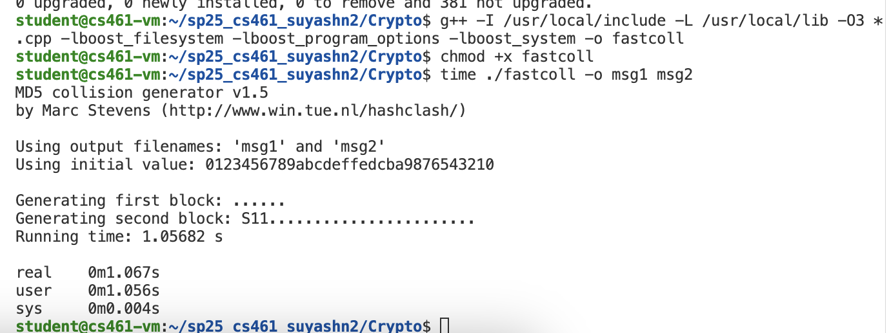

# 3.1.6 

A weak hashing algorithm

```python
from Crypto.Cipher import AES
ciphertext = load_ciphertext_we_gave_you_as_bytes()
key = load_key_we_gave_you_as_bytes()
iv = load_iv_we_gave_you_as_bytes()
cipher = AES.new(key, AES.MODE_CBC, iv=iv)
plaintext = cipher.decrypt(ciphertext)
# ciphertext must be multiple of 16 bytes
```

# 3.1.5
public key - is given to everybody for encryption  
private key - secret key used for decryption  
RSA decryption  
- e - public prime  
- n - public modulus  
- d - secret  
- m - plaintext  
- c - cipher-text  

encryption: $c = m^e mod(n)$  
decryption: $m = c^d mod(n)$  
checkpoint 2 goes over why only specific numbers will work
this is called modular exponentiation

pow(base, exp, modulus) -> does base**exp mod(modulus)
use this instead of base**exp % modulus (WHY?)

**Left Shift** - This moves all bits **to the left**, effectively **multiplying by powers of 2.  
**Right Shift** - This moves all bits **to the right**, effectively **dividing by powers of 2.  
Binary doesn’t have a fixed width unless you specify one.  
•	0b = binary literal prefix  
•	1010 = the actual bits  
•	This is just like:  
•	0x1F = hexadecimal  
•	0o77 = octal  
The leading zeros don’t change the value, just like 0010 = 10 in decimal.

```python
x = 5         # binary: 0b101  (5)
y = x << 1    # binary: 0b1010 (10)
y = x << 2    # binary: 0b10100 (which is 20)

x = 16
y = x >> 1    # binary: 00010000 (2^5 = 16)
y = x >> 2    # binary: 00001000 (2^4 = 8)

```




The first known collisions were announced on August 17, 2004 by Xiaoyun Wang, Dengguo Feng,
Xuejia Lai, and Hongbo Yu. Here’s one pair of colliding messages they published:
Message 1:
d131dd02c5e6eec4693d9a0698aff95c 2fcab58712467eab4004583eb8fb7f89
55ad340609f4b30283e488832571415a 085125e8f7cdc99fd91dbdf280373c5b
d8823e3156348f5bae6dacd436c919c6 dd53e2b487da03fd02396306d248cda0
e99f33420f577ee8ce54b67080a80d1e c69821bcb6a8839396f9652b6ff72a70
Message 2:
d131dd02c5e6eec4693d9a0698aff95c 2fcab50712467eab4004583eb8fb7f89
55ad340609f4b30283e4888325f1415a 085125e8f7cdc99fd91dbd7280373c5b
d8823e3156348f5bae6dacd436c919c6 dd53e23487da03fd02396306d248cda0
e99f33420f577ee8ce54b67080280d1e c69821bcb6a8839396f965ab6ff72a70

Convert each group of hex strings into a binary file.
(On Linux, run $ xxd -r -p file.hex > file.)
1. What are the MD5 hashes of the two binary files? Verify that they’re the same.
($ openssl dgst -md5 file1 file2)
2. What are their SHA-256 hashes? Verify that they’re different.
($ openssl dgst -sha256 file1 file2)


# 3.2.2

```bash
./fastcoll -p 


```


